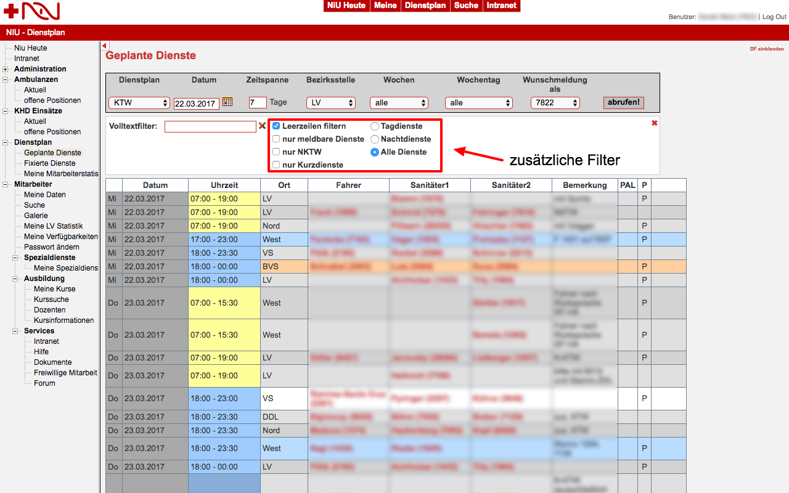
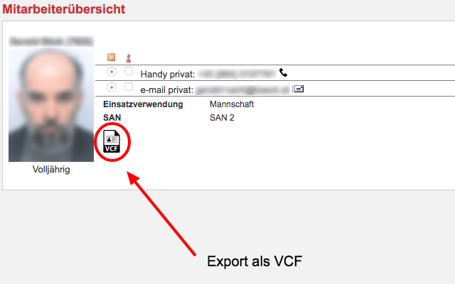
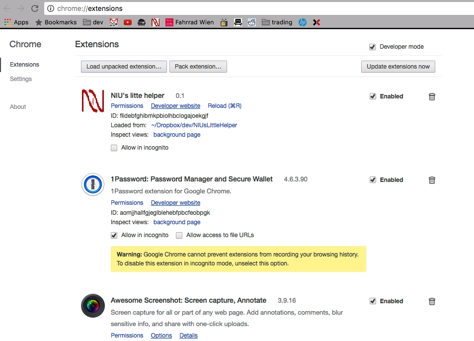

# NIU's little helper

Chrome Erweiterung zur einfacheren Bedienung des internen Verwaltungssystems des Wiener Roten Kreuz ([NIU](https://niu.wrk.at/)).

Derzeit werden folgende Funktionen unterstützt:

### Erweiterte Filter für den Dienstplan

### Erweiterte Filter für offene Positionen (Ambulanzen & KHD)

### Zusätzliche Daten zur Dienststatistik (Statistik, EmployeeDutyStatistic.aspx)

### Zusätzliche Daten zur LV-Statistik (LVStatistik, LVStatistic.aspx)
Eine zusätzliche Tabelle gruppiert die Anzahl der Dienste und Ausfahrten nach der
Dienstart (KTW, RTW) und der Position (Fahrer, SAN1, SAN2). Damit ist es leichter möglich die
benötigten Mindestausfahrten für Ausbildungen zu prüfen. Allerdings wird diese Statistik nur
quartalsweise abgeschlossen!

### Kurssuche

* Bei der Kurssuche wird für das Suchergebnis eine Volltextsuche in der Tabelle mit den gefundenen Kursen ermöglicht.

### Kursdetails

* Es wird die zuletzt verwendete Kostenstelle gespeichert
* Es wird automatisch ein Kürzel eingetragen, das über die Optionen des Browser Plugins gesetzt werden kann
* Das Drop-Down select Menü unterstützt jetzt eine Volltextsuche nach den Mitarbeiternamen bzw. der Dienstnummer

### Download von Kontaktdaten als VCF file

### Liste/Ausdruck
Die Funktion Mitarbeiter Liste/Ausdruck öffnet normal ein neues Fenster, in dem alle gefundenen Mitarbeiter angezeigt werden. Diese Liste wurde erweitert:

* Es gibt jetzt eine sortierbare Tabelle mit Volltextsuche
* Berechnung der Dienste und Stunden der letzten 6 Monate im Bereich RD (noch ohne Ambulanzen!)
* Abfrage der Grundausbildung der Mitarbeiter

Diese Abfragen werden in einer DB lokal zwischengespeichert um nicht unnötige Requests an den Server zu erzeugen.

## Getting Started

Diese Anleitung ermöglicht Dir, die Erweiterung direkt in Google Chrome zu testen, bevor sie im [Google Store](https://chrome.google.com/webstore/detail/nius-litte-helper/fdldehahkijcfpmjhgnkggopliakcknj?hl=de) erscheint. Der empfohlene Weg ist, die Extension über den [Google Store](https://chrome.google.com/webstore/detail/nius-litte-helper/fdldehahkijcfpmjhgnkggopliakcknj?hl=de) zu installieren.

### Prerequisites

[Google Chrome Browser](https://www.google.com/chrome/browser/desktop/)

### Installing

1. [Gepackte Extension herunterladen](https://github.com/geraldbaeck/NIUsLittleHelper/archive/master.zip)
2. Zip file in beliebiges Verzeichnis entpacken
3. Gehe zu [chrome://extensions/](chrome://extensions/) und Developer mode oben rechts einschalten.
4. Klick auf den Load unpacked extension button und wähle das vorher entpackte Verzeichnis aus.

## Version History

+ *0.1* initial commit
+ *0.2* VCF Download
+ *0.21* Kurzdienstselector wird nur mehr angezeigt, wenn es Kurzdienste gibt
+ *0.22* Die Kontakttabelle der Dienstführung wird jetzt standardmäßig ausgeblendet
+ *0.30* [NIU+ Features](#zusätzliche-daten-zur-lv-statistik-lvstatistik-lvstatisticaspx) eingebaut
+ *0.31* Zusätzliche Filter für geplante Dienste, Seite aufgeräumt
+ *0.32* Überarbeitete [FunktionärInnenfeatures](https://github.com/geraldbaeck/NIUsLittleHelper/pull/2)

## Built With

* [Atom](https://github.com/atom/atom) - Code Editor
* [Javascript](https://en.wikipedia.org/wiki/JavaScript) - I love you, but I hate you too
* [JQuery](https://jquery.com/) - I most definitely hate you
* jQueryUI
* PouchDB
* jQuery DataTable

## Contributing

Always welcome just fork and commit.

## [Authors](https://github.com/geraldbaeck/NIUsLittleHelper/graphs/contributors)

* **Gerald Bäck** - [github](https://github.com/geraldbaeck) - [blog](http://dev.baeck.at/)
* **Stephan Spindler** - [github](https://github.com/spind42)
* **Daniel Steiner**

## License

This is free and unencumbered software released into the public domain - see the [UNLICENSE.md](UNLICENSE.md) file for details. NIU is probably intellectual property of the Austrian Red Cross, but that's not relevant at all.
